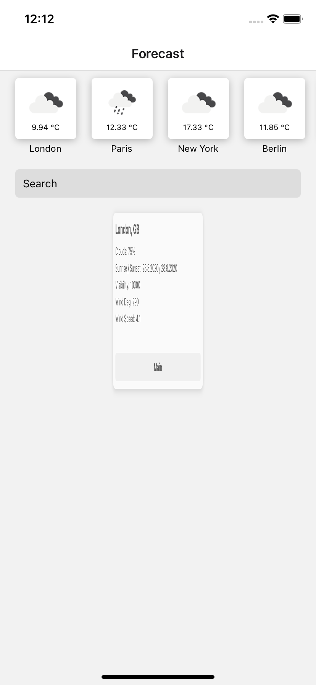
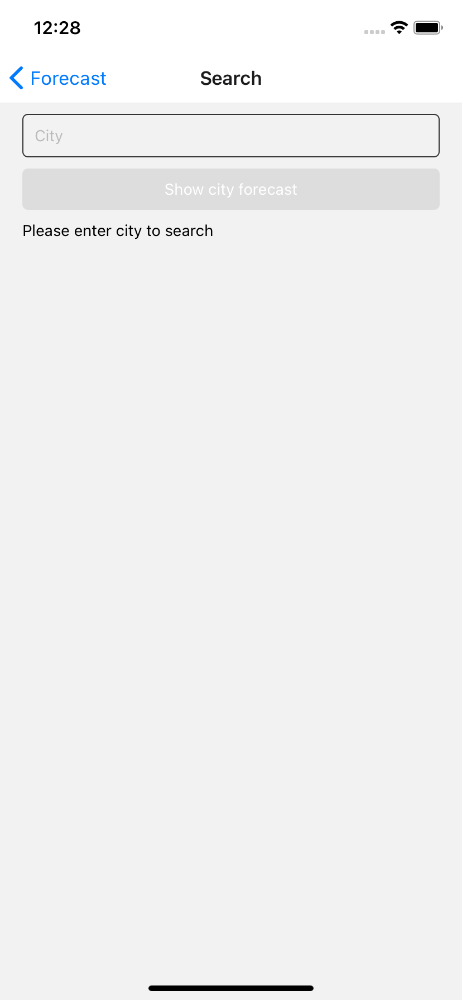
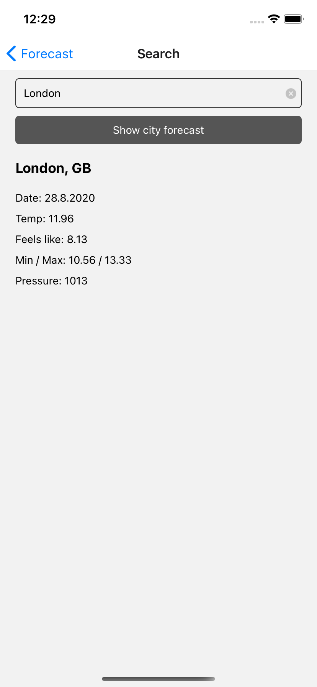

# Forecast app (IOS) for CV

Example project with the usage of technologies in which I have working experience.

## Forecast screen
| Forecast Front  | Forecast Back                                 | Forecast Flip                                  |
| --------------- | --------------------------------------------- | ---------------------------------------------- |
|     | ![][front]                                    |   |

## Search screen
| Search Result                                | Search Empty                                  |
| -------------------------------------------- | --------------------------------------------- |
|  |  |

``` 
    yarn ios 
```

[front]: [__screenshots__/screen-forecast-front.png]
[back]: [__screenshots__/screen-forecast-back.png]
[flip]: [__screenshots__/screen-forecast-flip.png]
[result]: [__screenshots__/screen-search-empty.png]
[empty]: [__screenshots__/screen-search-result.png]